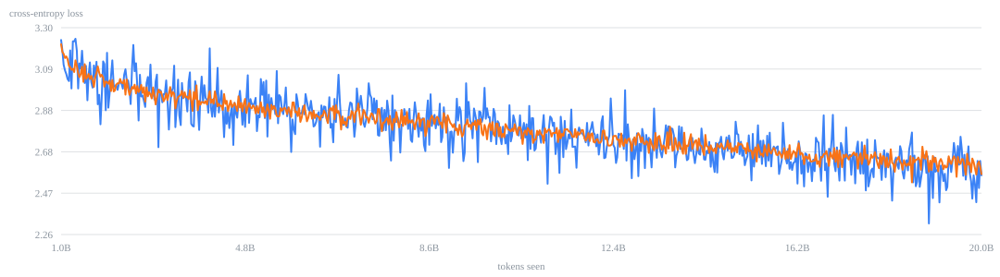
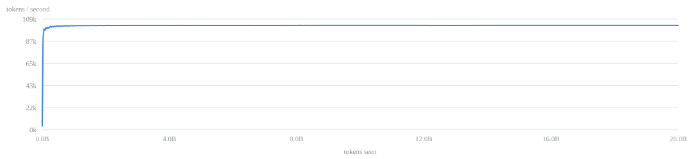
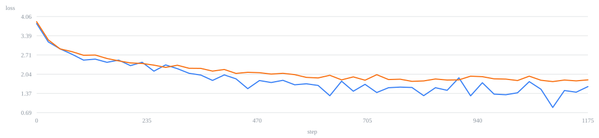

# Sprocket 500M

A 501M-parameter language model built from scratch: its own vocabulary, its own
model code, its own training and fine-tuning pipeline, and the cloud setup that
ran it unattended. Trained on 20 billion tokens, roughly 90 billion characters of
text, over 54 hours on one rented H100 for about $165.

The model is on [Hugging Face](https://huggingface.co/kandivault/sprocket-500m).
There is an [interactive page](https://kandivault-source.github.io/Sprocket-500M/)
where you can type into the real tokenizer and browse its vocabulary.



## What was built here

| | |
|---|---|
| Parameters | 501.1 million |
| Trained on | 20.0B tokens of FineWeb-Edu |
| Final loss | 2.564 validation, over 152,580 steps |
| Hardware | one H100 80GB, 54.3 hours |
| Cost | about $165 |
| Context | 2048 tokens |
| Vocabulary | 32,000, built from scratch |

Written for this project: the tokenizer, the model code, the training loop, the
fine-tuning stage, the corpus builder, the export step, and the script that runs
the whole thing on a rented machine. PyTorch does the calculus and the GPU
kernels. The training text comes from FineWeb-Edu, a public dataset.

## The machine it was not trained on

Development happened on an RTX 4060 with 8GB of memory, of which about 7GB is
actually usable. Training a model needs room for the model, its gradients, and
the optimizer's own bookkeeping, which together run about 16 bytes per parameter.
That caps this machine at roughly 340M parameters. The 501M model was never going
to fit.

So the plan was to build and debug everything against a small model that trains
overnight, then rent a big GPU only once the same code ran start to finish
without anyone watching it. The practice model was 76M parameters. It was not
meant to be good. It was meant to prove the pipeline before the pipeline started
costing $3 an hour.

## Reading text: the tokenizer

A model cannot read letters. It works from a fixed list of numbered text
fragments, and every input has to be chopped into pieces from that list.

The list has 32,000 entries and none of them were chosen by hand. They were
learned: start with raw bytes, then repeatedly glue together whichever pair of
pieces appears next to each other most often. Do that 31,728 times and you have a
vocabulary where common words are single entries and rare words break into
fragments. Starting from bytes rather than characters means nothing is ever
unreadable, including emoji and languages the training text never contained.

This is worth caring about because it sets the price of everything downstream.
This vocabulary averages about 4.5 characters per fragment on ordinary English.
Fewer characters per fragment would mean more compute for the same page of text,
a shorter working memory, and a bigger bill.

**[Try it here.](https://kandivault-source.github.io/Sprocket-500M/)** The page
runs the real tokenizer in your browser and lets you search the actual 32,000
entries. `scripts/verify_web_tokenizer.py` checks that browser version against
the real one and fails if they ever disagree.

## Making it twice as fast

The first cloud test run processed 63,470 tokens per second. Two changes took
that to 115,295, which on a fixed amount of text is close to halving the bill.

**The attention step was duplicating its own data.** The model uses fewer
key-value heads than query heads to keep memory small, and the original code
padded them back out to match by copying, building tensors five times larger than
needed on every layer of every step. A newer PyTorch feature does that
broadcasting internally instead. Swapping it in was checked for correctness
rather than assumed: outputs matched to within 9.18e-06, and every single
predicted token was identical.

**`torch.compile` was worth 1.70x on its own** and cut memory use from 62GB to
43GB at the same time. It cannot be tested on Windows, so this was only found by
measuring on the rented machine.



Flat for 54 hours. No slowdown, no stalls, no drift.

A sweep of 11 settings picked the final configuration. A shorter context would
have been about 10% faster, but a model that can only remember 1024 tokens is
barely usable in conversation, and over the whole run that speed was worth about
$14.

## How much text to train on

More text always helps, but not proportionally. Going from 10B to 50B tokens
costs five times as much for roughly 21% improvement, and the curve flattens
around 15-20B. So 20B it was.

That works out to 40 tokens of training text per parameter, which is the number
that decides what this model should be compared against. GPT-2-medium had about
28 and Cerebras-GPT-590M had 20. Qwen2.5-0.5B is a similar size but saw about
36,000, roughly 900 times more text. It is a much better model, and no amount of
architecture would close that gap.

## Teaching it to answer

Pretraining produces something that continues text but does not respond. Ask it a
question and it may just write more questions. A second stage fixes that, training
on example conversations with the scoring masked to the assistant's replies only,
so the model is never graded on predicting what the user said.



1,192 steps, ending at 1.840 validation loss. The gap opening around step 600 is
where more repetition stopped helping.

## The result worth writing down

Two capabilities were trained the same way, from the same data, in the same run.
Tool calling worked. Memory did not.

Tool calling had 590 training examples and learned to produce correctly formatted
requests, pick the right tool when given decoys, use what came back, and stay
quiet when no tool was needed. Memory had 237 examples and never triggered at
all. Repeating the memory examples 24 times over did not fix it. Instead the model
started answering "remember this" by calling a tool.

At this size the model reliably learns one such behaviour and the stronger one
squeezes out the weaker. More repetition made it worse, which points at a
capacity limit rather than a shortage of examples. That only turned up by reading
what the model actually wrote, not by looking at a score.

The follow-up mattered more. If one of these was already crowding out the other,
the obvious question was what they were costing ordinary conversation. So a
second fine-tune ran from the same starting point with the tool and memory
examples stripped out entirely. That version holds a conversation noticeably
better, and it ships alongside the first. Both are published, because they are
genuinely different tradeoffs: one can call tools, the other talks.

At 501M parameters there is a real budget, and spending part of it on a
mechanical output format costs something somewhere else.

## Running for 54 hours with nobody watching

Rented GPUs get reclaimed with little warning, so anything that needs supervision
will eventually fail at 3am. The setup in `cloud/bootstrap.sh` assumes that.

**Everything resumes.** A saved checkpoint carries the model, the optimizer, the
position in the learning-rate schedule, the random number state, and the token
count, so a restarted run continues as if nothing happened instead of quietly
starting its schedule over. Checkpoints are written to a temporary file and moved
into place in one step, so being interrupted mid-write cannot corrupt a good one.

**A preflight check exercises everything before spending a penny.** GPU access,
every import, the tokenizer's special entries, the conversation formatting, the
training data, and a real upload to prove the credentials work. Anything
environmental fails in about a minute instead of on day five.

**Three separate things can stop the billing:** finishing normally, a handler that
fires on any crash, and a hard time limit for the case where it hangs rather than
crashing. All three were tested.

## What only a real run could teach

Six failures showed up in cheap test runs, none reproducible locally:

1. A dependency was unpinned, resolved to a new major version, and crashed during
   the final export step, after training had already finished. On a real run that
   lands on the last day.
2. The corpus builder wrote once per document. Against network storage that is
   194,000 tiny writes: six times slower than writing locally.
3. Leftover state from a test run killed the first real launch 20 seconds after a
   clean preflight, and it shut down so tidily that it looked like it was running.
4. A leftover checkpoint made the fine-tuning stage silently do nothing. It
   reported "resumed at step 466/465" and then "complete", having trained on
   nothing at all, and would have published the test model as the real one.
5. The guard against that needed its own guard. It was triggered by a setting
   passed in at launch, so every restart would re-trigger it and throw away the
   work in progress. It now records that it has already run.
6. GGUF conversion recognises tokenizers by matching a fingerprint against a
   known list. A custom one is not on that list, so conversion failed after the
   model had trained and uploaded.

The pattern: the expensive failures were not in the model. They were in the
joins. Version resolution, filesystem behaviour, and resume logic that was too
willing to believe it had already finished.

## Layout

```
src/model/model.py        the model
src/train/train.py        training loop, resume, data loading
src/train/sft.py          fine-tuning on conversations
src/tokenizer/            building the vocabulary
scripts/build_corpus.py   downloading and preparing training text
scripts/export_hf.py      export, with a check that outputs still match
scripts/plot_run.py       turns the run log into a report
docs/index.html           the interactive tokenizer page
cloud/bootstrap.sh        runs the whole thing on a rented machine
cloud/RUNPOD.md           cloud setup, real costs, and what goes wrong
logs/train.log            the complete run log
```

`logs/run_report.html` is a single self-contained file with the full charts and
data table, generated from that log.

## Data

Training text is FineWeb-Edu, downloaded at build time rather than stored here.
Safety examples use prompts from LibrAI's do-not-answer set. See NOTICE for
licensing.

The conversation data used for fine-tuning is not distributed here. The scripts
that generate it are (`workflows/`, `scripts/harvest_round.py`,
`scripts/consolidate_instruct.py`), but their output is not. Pretraining and the
speed work reproduce without it.

## License

Apache 2.0. See LICENSE and NOTICE.
